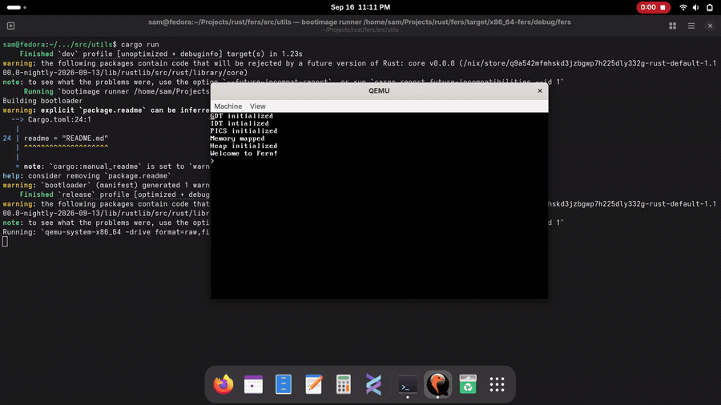

# Fers
Some random kernel I'm trying to make for fun, hopefully it can be an operating system later.



Try it:

```bash
git clone https://www.github.com/kasapeli/fers.git (git@github.com:kasapeli/fers.git over ssh)
cd fers
cargo install bootimage
cargo run
```

Make sure you have Rust Nightly, or just use the flake.

## License
Fers is provided under the [MIT license.](LICENSE)
